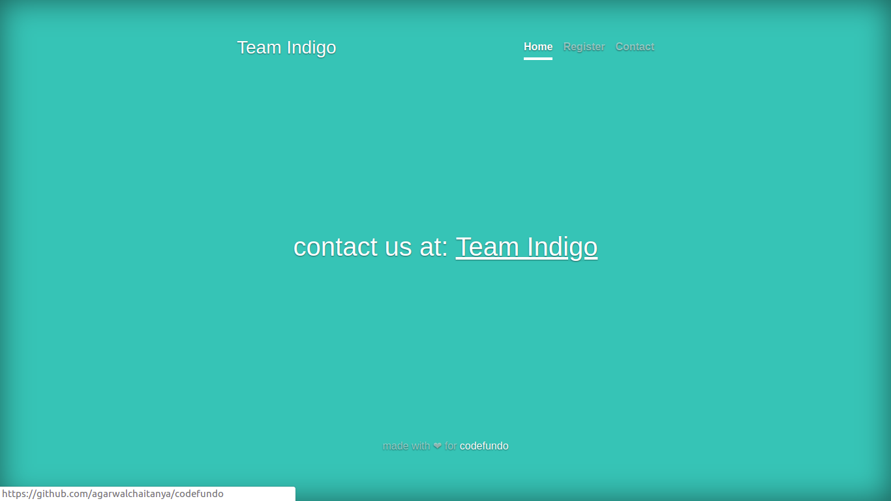

# Code.Fun.Do++
## HUB Implementation
* HUB is a resource sharing platform where merchants can register and donate per the requested resources.
* It is realised in the form of a webapp, built using Django. The Database utilised is Azure MySQL.
* It employs the admin, user model. The users are merchants willing to provide resources and the admin is a disaster relief organization.
* It employs a payment platform for 
#### The following is our SQL Model, for storing and querying data.

TABLE USER stores a Merchant's details
``` python
class Users(models.Model):
    FOOD = 'FOOD'
    CLOTHING = 'CLOTHING'
    MISC = 'MISC'
    NULL = 'NULL'

    Product_Types_choices = (
        (FOOD, 'Food'),
        (CLOTHING, 'Clothing'),
        (MISC, 'Miscellaneous'),
        (NULL, 'Nothing'),
    )
    
    name = models.CharField(max_length=100)
    email = models.EmailField(max_length=150, primary_key=True,unique=True)
    phone=models.CharField(max_length=10)
    prod_type = models.CharField(max_length=10,choices = Product_Types_choices, default=NULL)
    paypal_id = models.CharField(max_length=250)
    password = models.CharField(max_length=150)
    user_type = models.CharField(max_length=150)
 ```
 TABLE PRODUCT stores the list of products/services offered by the merchants
 ```python
 class Product_List(models.Model):
    FOOD = 'FOOD'
    CLOTHING = 'CLOTHING'
    MISC = 'MISC'

    Product_Types_choices = (
        (FOOD, 'Food'),
        (CLOTHING, 'Clothing'),
        (MISC, 'Miscellaneous'),
    )
    
    email = models.ForeignKey('Users', on_delete=models.CASCADE)
    user = models.CharField(max_length=100)
    prod_type = models.CharField(max_length=10, choices = Product_Types_choices)
    product = models.CharField(max_length=200,blank=False)
    price = models.PositiveIntegerField()
    qty = models.PositiveIntegerField()
   ```
 Django's default DB is set to Azure MySQL
 ```python
 DATABASES = {
    'default': {

        'ENGINE': 'django.db.backends.mysql',

        'NAME': 'indigocodefundo',                     

        'USER': 'agchaitanya',                     

        'PASSWORD': '',                  

        'HOST': 'localhost',                     

        'PORT': '3306',

    }
}
```
#### HUB's Home Page

#### HUB Registration Page for Merchants

#### HUB Contact Us Page

#### HUB Dashboard


# Drone Documentation

## Implementation of Recognition Model

- The current model for human recognition(which will be used to process images sent by the drone), on Azure, works at 64% precision and 41% Mean Average Precision(mAP). 
- It is implemented by training the model with images of people from previous natural disasters. It broadly classifies people based on their apparent size and orientation in the image as :-
  - Medium: 
    - Front facing
    - Back facing
    - Side facing
  - Small:
    - Front facing
    - Back facing
    - Side facing <br >
This allows the model to identify humans in the image whether they are near the drone or far away. 
- Maximum accuracy has been achieved when a person is facing the drone, while the model has lesser precision when the person is oriented with their back to the drone's camera.
- The model has been trained with 169 images from:
  - Kerala Floods (2018)
  - Japan Floods (2018)
  - South East European Floods (2018)
  - Maryland Floods (2018)
  - Quebec Floods (2017)
  - Alberta Floods (2013)
  - Thailand Floods (2010)
  - Hurricane Harvey Induced Flooding (2017)
- The model is also capable of recognizing make-shift rafts and damaged cars.

## Implementation of the Mapping System

- The mapping system is based on the Bing Maps API for Enterprices(provided by Azure), which uses the information from the drone and the Custom Vision model(Human Recognition Model), to provide a visual representation of people's locations on a map of the affected area.
- The file containing information supplied by the drone is of the GeoJson filetype, which is one of the best formats for processing geo-spatial data. 
- A simple HTML file is created that calls the Bing Maps API and uses its inbuilt tools to pinpoint people's locations on the map.
- An Ajax styled implementation will also be able to support real time tracking of the people in the affected regions.
- The above can be implemented very easily on Bings API by running the below code in a browser and dragging and dropping the GeoJson file onto the map shown on the browser
``` HTML
<!DOCTYPE html>
<html>
<head>
    <title></title>
    <meta charset="utf-8" />
    <script type='text/javascript'>
    var map;
    function GetMap() {
        map = new Microsoft.Maps.Map('#myMap', {
            zoom: 1
        });
        //Load the GeoJSON module.
        Microsoft.Maps.loadModule('Microsoft.Maps.GeoJson', function () {
            
        });
    }
    function handleFileSelect(evt) {
        
            var reader = new FileReader();
            reader.onload = function (e) {
                try {
                    var geoJsonText = e.target.result;
                    //Attempt to parse the file as GeoJSON and add the shapes to the map.
                    var shapes = Microsoft.Maps.GeoJson.read(geoJsonText);
                    map.entities.push(shapes);
                    
                    //Calculate the bounding box of the data in the single file. 
                    var bounds = Microsoft.Maps.LocationRect.fromShapes(shapes);
                    //If data is already loaded from another GeoJSON file, merge the bounding boxes together.
                    if (dataBounds) {
                        dataBounds = Microsoft.Maps.LocationRect.merge(dataBounds, bounds);
                    } else {
                        dataBounds = bounds;
                    }
                    //Update the map view to show the data.
                    map.setView({ bounds: dataBounds, padding: 50 });
                } catch (e) {
                    alert('Unable to read file as GeoJSON.');
                }
            };
    }
    </script>
    <script type='text/javascript' src='https://www.bing.com/api/maps/mapcontrol?callback=GetMap&key=[API KEY]' async defer></script>
</head>
<body>
    <div id="myMap" style="position:relative;width:800px;height:600px;"></div>

</body>
</html>
```

## Screenshots of Maps Implementation


### Implementation of the Drone(Physically)


## Drone Processes and Mesh Implementation for data tranfer
A brief documentation on the drone implementation and mesh networking 

### Drone Processes and their pseudo-implementations

 __The drone had the following requirements__
  * GPS Enabled
  * 3-Axis Camera 
  * On-board SoC
  * Connectivity to the Base Stations
 
The drone of our choice is the DJI M200 Series Quadcopters (specifically the M210) with the addition of the Zenmuse Z30 Camera Module due to:
* Their robust design and high enurance to various natural conditions such as high/low temperature and water and dust resistance. 
* Long Battery Life of 38min.
* Inbuilt GPS Support
* Autonomous Flight support (even when it is out of the range of the manual RC).
* Support for the Onboard SDK (the one used), along with the support for Mobile SDK.
* Fairly sufficent Payload capability, and support for various other modules. 
* The camera module Zenmuse Z30 was specically chosen due to its support for very high zoom capability, which is perfect for high altitude flight as well low altitude flight. 

 

##### The Basic Working Model of the drone

1. Each drone is connected to either the previous drone or more drones through a mesh network to FANET System. 
2. Each drone is assigned a circular region, the radius of which is given by  ; where *R* is the distance from the previous drone/base (effectively the radius of the drone), *X* is the range of the transmission device, and *r* is the deviation of the drone from the centre of the circular region. 
3. The respective latitude and longitude of the centre of the circular region is then decided, and the first waypoint is set to that.
4. The subsequent waypoints are generated randomly within the circular region such that  ; where  is the radial position of the drone from the centre of the circular region,  is the centre of the circular region, and *r* is the max deviation from the centre. 
5. At each waypoint, the drone snaps 4 photos each at  to each other. This is paired with the GPS co-ordinate of the drone and sent to the base station for analysis.
7. The actual distance  of the people from the drone is calculated using the equation ; where  is the angle of depression of the camera of the drone, *s* is the distance of the people from the drone, and *h* is the height of the drone. 
8. After the drone travererses, through all the waypoints it returns back to the base station, and is replaced with another one at the same co-ordinates. An alternate solution is to cascade the drones, so when the first one is out of duty, the second one in line replaces its position so as to still maintain connection to the base station. 

__Code for the latitude and longitude generation__

```python
import random

#Base Latitude and Longitude
baseLatitude = 0.0 
baseLongitude = 0.0 
baseAltitude = 0.200

#Maximum range of the Wi-fi dongle on the drone
maxRange = 3.0

#Maximum deviation from center for the drone
maxDev = 1.0

def newLatitude(oldLat, distance):

	#using the formula 1 deg ~ 110.574km
	degreeChange = distance/110.574
	newLat = oldLat + degreeChange
	return newLat

def newLocation(oldLat, oldLong, oldAlt):

	#to calculate new center of drone
	newDistance = maxRange - (2 * maxDev)

	#the drone travels in a geodesic
	#ie. only the latitude or the longitude changes
	newLat = newLatitude(oldLat,newDistance);

	with open ("locations.txt", "w") as fwrite:

		fwrite.write(str(newLat)+' '+str(oldLat)+' '+str(oldAlt)+ ' ')

	oldLat = newLat

	for i in range(10):
		newDistance = random.random()*maxDev
		newLat = newLatitude(oldLat,newDistance)

		with open ("locations.txt", "a") as fwrite:
			fwrite.write(str(newLat)+' '+str(oldLat)+' '+str(oldAlt)+' ')

		oldLat = newLat
		
newLocation(baseLatitude,baseLongitude,baseAltitude)
  ```


__Code for the Waypoint Setting and Controlling the Drone__ 

A basic implementation of the algorithm for waypoint was done in __C++__. Due to sheer size and quantity of files, only the *most* important files have been uploaded. The other files are assumed to be understood. 

Link : [C++ Files ](https://1drv.ms/f/s!Am8mfksK8R_6gQY6ujGGNK6M3i8y)

### Mesh Networking (FANET) System

An intuitive solution to the lack of structured communication services in the times of natural disasters is to develop an ad-hoc network among the drones and the rescue operators. This forms what is known as a *Flying Ad-Hoc Network*. 

__Features__
* Each drone is fitted with a Raspberry Pi Model B and a WiFi dongle attached to the Raspberry Pi. 
* A linux based operating system called the __ByzPi__ (developed from Byzantium Operating System) is loaded onto the drones. 
* Any person with a device which has support for AD-HOC Networks can connect. 
* Supports connection to the internet, so as to send information at large distance when required.
* The message sent from one of the drone is relayed across other ones thorugh the most *reliable* path until it reaches the Base Station for processing. 
* Rescue Operator can also send requests to the Base Station using the same Ad-Hoc Network. 
* Upon addition of crendential to each node, it may also be possible to enable crowd sourcing of the information at various locations (and classifying them as weak classifiers, until a suitable number of them results to a considerable amount).
